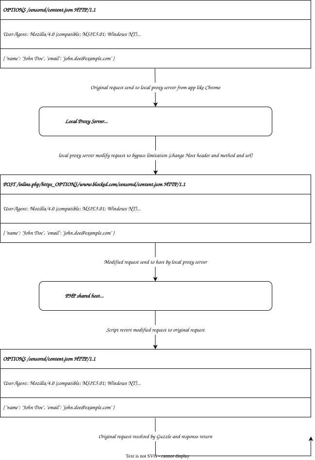

<div dir="rtl">

# Configuración de proxy con host compartido PHP



</div>

## ¿Por qué usar un host compartido PHP?

<div dir="rtl">

- **Precio accesible:**  
  Los hosts compartidos suelen tener un costo mucho menor que los servidores dedicados, lo que resulta atractivo para muchos usuarios.
- **IPs limpias:**  
  Los hosts generalmente utilizan IPs limpias y legítimas, lo cual puede mejorar el rendimiento del proxy.
- **Ancho de banda ilimitado:**  
  Muchos proveedores de hosting ofrecen ancho de banda ilimitado, una característica ideal para un proxy, ya que permite navegar sin preocuparse por límites de consumo.
- **Configuración más sencilla:**  
  Gestionar un host compartido y desplegar un script PHP sencillo es mucho más fácil que administrar un servidor dedicado o virtual.

</div>

## ¿Cuáles son los inconvenientes?

<div dir="rtl">

- **Limitaciones de protocolos:**  
  Los hosts compartidos pueden soportar solo un conjunto limitado de protocolos, lo cual podría afectar el rendimiento del proxy.
- **No optimizado para móviles:**  
  Este método aún no está optimizado para dispositivos móviles y requiere más desarrollo.
- **Complejidad para usuarios comunes:**  
  El uso de este tipo de proxy puede resultar confuso para usuarios no técnicos y requerir más guía.

</div>

## ¿Cómo funciona?

<div dir="rtl">

En general, este método es similar al funcionamiento de un **HTTP Proxy**, pero debido a las limitaciones, existen diferencias en su implementación:

1. La solicitud original se manipula para poder enviarla al host proxy.
2. Una vez que la solicitud manipulada llega al host proxy, se recupera la solicitud original, se procesa y se devuelve la respuesta al usuario.

```ini
==OriginalRequest==> (local http proxy server: manipulate request to change method and url) ==ManipulatedRequest==> (proxy shared host: recover original request using script and resolve it and return response) ==Response==>
```

</div>

## Analicémoslo con un ejemplo

<div dir="rtl">

Supongamos que queremos enviar la siguiente solicitud a la dirección `www.blocked.com/sensored/content.json`:

```ini
OPTIONS /sensored/content.json HTTP/1.1
User-Agent: Mozilla/4.0 (compatible; MSIE5.01; Windows NT)
Host: www.blocked.com
Content-Type: application/json

{ "name": "John Doe", "email": "john.doe@example.com" }
```

### Limitaciones

- **Limitación en el método:**  
  Es posible que el método original (como `OPTIONS`) no sea compatible en el host; por lo tanto, debemos cambiar el método a `POST` antes de enviarlo y recuperarlo nuevamente en el host.
- **Encabezado Host:**  
  El encabezado `Host` de la solicitud original es diferente al del host proxy y debe reemplazarse.

### ¿Cuál es la solución entonces?

Modificamos la dirección de la solicitud para que llegue al host proxy. Por ejemplo:

```ini
https://www.blocked.com/sensored/content.json
```

Se convierte en:

```ini
https://www.proxy-host.com/inline.php/https_OPTIONS/www.blocked.com/sensored/content.json
```

Entonces, en este caso, se enviará la siguiente solicitud en lugar de la original (en este ejemplo, la solicitud anterior):

```http
POST /inline.php/https_OPTIONS/www.blocked.com/sensored/content.json HTTP/1.1
User-Agent: Mozilla/4.0 (compatible; MSIE5.01; Windows NT)
Content-Type: application/json
Host: www.proxy-host.com

{ "name": "John Doe", "email": "john.doe@example.com" }
```

### Explicación de las partes de la URL

| Parte                                     | Explicación                                                                                                                                                                          |
| --------------------------------------- | ------------------------------------------------------------------------------------------------------------------------------------------------------------------------------ |
| `https://www.proxy-host.com/inline.php` | Ruta del script en el host compartido. También puede actuar como un token para cada usuario. Es decir, el script podría alojarse en un archivo `unpredictable_personal_token.php` en lugar de `inline.php` |
| `https_OPTIONS`                         | Sección de configuración: protocolo y método. Se separan con `_` y son opcionales. También puedes agregar `debug` (`https_OPTIONS_debug`).                                                           |
| `www.blocked.com/sensored/content.json` | Dirección original de la solicitud junto con todos sus parámetros.                                                                                                                                     |

### ¿Por qué creo que este método es mejor?

Al agregar los cambios solo en la dirección, podemos eludir filtros o bloqueos con el mínimo alteración.
Por ejemplo, considera una biblioteca que interactúa con la dirección `https://api.telegram.org` y la guarda en la variable `$baseUrl`.
Simplemente tienes que cambiar `$baseUrl` a `https://www.proxy-host.com/inline.php/https/api.telegram.org`. ¡Sin necesidad de manipular los encabezados! Eso es todo.

</div>

## ¿Debemos modificar las URLs manualmente?

<div dir="rtl">

No. Para esto usamos **MitmProxy** y manipular las solicitudes automáticamente. Los archivos necesarios se encuentran en la ruta `client/addons.py`.

### Pasos de instalación y configuración

Clona el repositorio para tener los archivos disponibles.

Descarga una de las versiones portátiles de MitmProxy desde <https://www.mitmproxy.org/downloads> y mueve el archivo `mitmdump.exe` a la carpeta `client`.

Ejecuta el archivo mitmdump.exe una vez para que se generen los archivos de certificados de seguridad necesarios.

Para instalar el certificado, ejecuta el siguiente comando en Command Prompt (Símbolo del sistema de Windows):

```bash
certutil -addstore root "%USERPROFILE%\.mitmproxy\mitmproxy-ca-cert.cer"
```
Para el navegador Firefox, realiza los pasos adicionales según la guía oficial de MitmProxy.

Abre el archivo addons.py y completa la variable config con la configuración necesaria.

Finalmente, ejecuta MitmProxy con los siguientes parámetros:

```bash
mitmdump.exe -s addons.py
```

 En la configuración de proxy del sistema de Windows, establece el proxy en `127.0.0.1` y el puerto en `local_server_port` (aquí 8080).

</div>

## ¿Qué debemos hacer para el host?

<div dir="rtl">

Ejecuta el comando `composer require akrez/http-proxy` para que se cree la carpeta `vendor`. Ahora crea un archivo, por ejemplo `inline.php`, y copia el siguiente código en él. Sube la carpeta `vendor` y el archivo `inline.php` al host.

```php
<?php

require_once './vendor/autoload.php';

use Akrez\HttpProxy\Factories\InlineFactory;
use Akrez\HttpProxy\Senders\CurlSender;

$request = InlineFactory::emitSender(new CurlSender);

```

- La ruta `./vendor/autoload.php` puede variar según dónde lo subas.
- El archivo `inline.php` puede tener cualquier otro nombre, como se mencionó anteriormente.
- Si el valor de `$request` es `null`, significa que el script no se invocó correctamente, por ejemplo, se llamó solo a `https://proxy-php-host.com/inline.php` sin los parámetros necesarios.

</div>

## ¿Por qué lo escribí?

<div dir="rtl">

- **Para aliviar nuestro cansancio:**  
  Aquí estamos poniendo esfuerzo 😃. Este proyecto es el resultado de 4 años de trabajo en tiempo libre y unas 7000 líneas de código, implementadas con varias bibliotecas como walkor/workerman, reactphp/reactphp, etc., pero que no funcionaron hasta que finalmente encontré la mejor solución.
- **Para mejorarlo:**  
  Aún no he encontrado una forma adecuada para acceder desde móviles. Además, creo que la implementación es difícil para el usuario promedio y aún hay varios errores por solucionar.
- **Para que tomen la idea y lo mejoren:**  
  Esta idea vino a mi mente, pero espero que después de leer el código y la idea general de este proyecto, ustedes puedan crear soluciones aún mejores (por ejemplo, utilizando Http Tunnel).
- **Y para que lo usemos:**  
Lo más importante es esto: disfrutar de la conexión a internet libre con el máximo anonimato 🎉 
Por favor, tengan en cuenta a los demás; no solo importamos nosotros.

</div>
